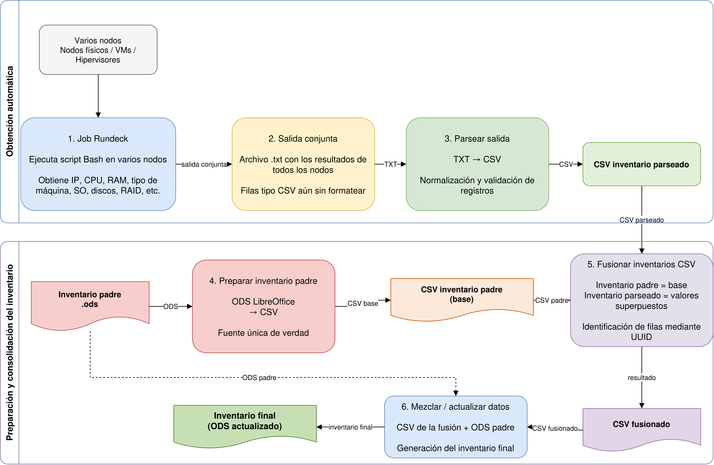

# Datacenter Inventory Pipeline



## Overview

This project implements an automated datacenter inventory pipeline that collects infrastructure metadata from remote nodes, normalizes the raw output, and merges it into a centralized, validated inventory. The process is driven by Rundeck for remote execution and by a Python-based ETL flow for cleaning, transforming, and consolidating data.

The pipeline is designed to answer a common operational need: keep an accurate and reproducible inventory of servers, virtual machines, hypervisors, networking details, OS information, hardware attributes, and BIOS metadata without relying on manual spreadsheets or ad hoc collection procedures.

The workflow follows the project’s actual operational architecture:

1. Rundeck executes a Bash script on each target node.
2. Raw node metadata is collected in a semi-structured text format.
3. A Python parser converts the output into a consistent CSV schema.
4. A master inventory is prepared from an ODS source and normalized to CSV.
5. The parsed output is merged into the master inventory using a controlled key-based join.
6. The final result is a consolidated inventory ready for downstream use.

## Architecture and data flow

The project follows the sequence represented in the diagram under the assets folder.

```text
Many nodes
  |
  v
Rundeck job
  |
  v
Combined raw output
  |
  v
Parse output to CSV
  |
  v
Prepare master inventory (ODS -> CSV)
  |
  v
Merge / update master inventory
  |
  v
Final consolidated inventory
```

## Main components

### 1) Rundeck collection script

The Bash script `asset_information.sh` is the node-side collector. It is intended to be executed by Rundeck against datacenter machines and gathers information such as:

- machine name and type
- host OS and version
- hypervisor / virtualization signature
- network interfaces and IP addresses
- MAC addresses
- CPU model, core, thread, socket counts
- RAM
- BIOS version and release date
- system UUID
- DMI / manufacturer / product metadata
- disk and storage information, when available

The script is defensive and resilient: it resolves system paths under `/sys`, uses `dmidecode` when needed, normalizes values, handles command availability checks, and avoids failing the entire job on non-critical read errors. It also normalizes blanks and values such as N/A to keep the downstream CSV consistent.

### 2) Schema definition

The file `header_list.txt` defines the output schema for the pipeline and the merge behavior. Each entry follows the pattern:

```text
COLUMN_NAME|FLAG
```

Where:

- `0` = column is preserved but not processed for update
- `1` = column is included in the normal merge/update logic
- `2` = column is the unique join key used to match rows between inventories

This file acts as the contract between the raw Rundeck output and the final inventory structure.

### 3) Raw-output parser

The Python script `parse_job_output.py` reads the text output from Rundeck and normalizes it into a CSV that matches the schema declared in `header_list.txt`.

Key behaviors:

- it accepts fields in any order
- it validates that every key in the raw output exists in `header_list.txt`
- it detects malformed rows and duplicate keys
- it fills missing values with `N/A` when required
- it emits a clean CSV ready for the next stage

The parser is intentionally strict: it fails fast when key names do not match the expected layout, which prevents silent corruption of the centralized inventory.

### 4) Master inventory preparation

The script `prepare_master_inventory.py` prepares the authoritative master inventory. In this project, the master inventory originates in ODS format and is converted to CSV for processing.

This stage:

- converts the ODS file to CSV using LibreOffice in headless mode
- validates the header against `header_list.txt`
- checks that required columns exist in the master inventory
- rejects duplicated headers or missing required fields
- emits a clean master CSV while preserving extra columns that are not part of the merge model

This means the master inventory remains the source of truth, while the parsed result enriches it without overwriting fields that should remain controlled.

### 5) Merge and consolidation

The script `merge_inventories.py` is the core of the ETL merge step. It performs a left join-like merge between:

- the parsed inventory generated from Rundeck output
- the master inventory prepared from the ODS master

The logic is controlled by the single column flagged as `2` in `header_list.txt`, which is the join key. In this project, the key is the machine UUID.

Merge rules:

- all rows from the master inventory are preserved
- rows with empty, N/A, or non-settable keys are left untouched
- duplicate keys are excluded from merging to avoid ambiguous updates
- only non-empty values coming from the parsed inventory override matching fields flagged with `1`
- the key field itself is never overwritten

This preserves the master inventory as the base while updating only the fields intended to be refreshed.

### 6) Shared helper layer

`base_inventory.py` centralizes the common CSV and validation utilities used by the three Python scripts. It provides functions for:

- validating `header_list.txt`
- parsing CSV values while respecting quoted fields
- cleaning values and normalizing N/A conditions
- identifying malformed lines and invalid data structures

This keeps the ETL logic consistent across parsing, master preparation, and final merge.

## Project structure

```text
.
├── asset_information.sh
├── base_inventory.py
├── header_list.txt
├── merge_inventories.py
├── parse_job_output.py
├── prepare_master_inventory.py
├── assets/
│   ├── flujo_inventario_datacenter.drawio
│   └── flujo_inventario_datacenter.png
├── LICENSE
├── README.md
└── .gitignore
```

## Typical pipeline execution

The expected flow is:

1. Run the Bash inventory script against the fleet of servers using Rundeck.
2. Save the raw output as a job result log.
3. Parse the raw output with `parse_job_output.py`.
4. Convert the master ODS inventory to CSV with `prepare_master_inventory.py`.
5. Merge the parsed inventory into the master inventory with `merge_inventories.py`.
6. Review the final CSV and use it as the centralized datacenter registry.

Example usage:

```bash
python3 parse_job_output.py job_output.log parsed_job_output.csv
python3 prepare_master_inventory.py master_inventory.ods
python3 merge_inventories.py parsed_job_output.csv master_inventory.csv merged_inventory.csv
```

## Operational goals

This project is designed to support infrastructure governance and operational awareness by providing:

- an automatic inventory of datacenter nodes
- a repeatable and auditable collection process
- a standard schema for downstream automation
- a safe merge model that preserves source-of-truth records
- a centralized inventory for reporting, validation, and planning

## Data quality and correctness constraints

The scripts enforce stricter data-quality controls than a typical CSV importer:

- required columns must exist in the expected source files
- duplicate columns and duplicate IDs are treated as risk conditions
- malformed key-value pairs are rejected
- unknown fields in Rundeck output raise an error
- invalid or duplicate merge keys are excluded from the update process

This makes the pipeline safer for operational use, especially when the output becomes a trusted inventory record.

## Security considerations

Because the pipeline touches servers, hardware metadata, network information, and operating-system details, it is important to avoid exposing sensitive data in logs or repositories.

Recommended practices:

- keep credentials out of source control
- restrict access to Rundeck jobs and target nodes
- use secure transport or vaulted credentials for remote execution
- avoid committing raw inventory outputs if they contain sensitive details
- review job permissions and audit access to generated files

## Summary

This repository implements a practical ETL pipeline for datacenter inventory management. It combines Rundeck-driven system collection, strict schema normalization, master inventory validation, and controlled merge logic to generate a trustworthy centralized inventory from heterogeneous raw machine data.

The design focuses on reliability, traceability, and repeatability, which are essential for infrastructure operations in medium or large datacenter environments.