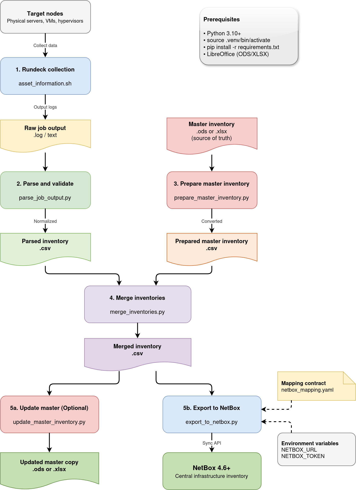

# Architecture and Data Flow

This document describes the general architecture of the **Datacenter Inventory Pipeline**, the data model that supports it, and the design decisions behind each stage.

---

## Overview

The pipeline follows a linear and deterministic ETL (Extract, Transform, Load) sequence:

```text
Rundeck (Nodes) → Shell Script → Log → Parser → Parsed CSV
                                                     ↓
                         Master Sheet (ODS/XLSX) → Prepared CSV
                                                     ↓
                                              Consolidated CSV (Merge)
                                                     ↓
                                                  NetBox (API)
```



The diagram source file (`inventory_pipeline.drawio`) is located in `docs/assets/`.

---

## UUID Merge Model

The **inventory UUID** (`inventory_uuid`) is the master key that connects all stages of the pipeline. It is extracted directly from the node's hardware/BIOS using the Bash collection script and remains intact throughout the entire flow.

### Merge Rules (Consolidation)

The [`rundeck_header_list.txt`](../rundeck_header_list.txt) file defines the column contract and update rules using numeric flags:

| Flag | Behavior | Example |
| ------ | --------------- | --------- |
| `0` | **Preserve** the master value. It is never overwritten. | Manual columns (Rack, Role) |
| `1` | **Update** if the parsed value is not empty. | Dynamic data (OS, CPU, RAM) |
| `2` | **Merge key**. Exactly one must exist. | `UUID` |

The merge key is currently the machine UUID. Parsers resolve columns by name, so the column order does not need to match.

### UUID Normalization

To guarantee the idempotency of the synchronization with NetBox, the pipeline normalizes all UUIDs to **lowercase** before any comparison or submission to the API. This prevents duplicates caused by capitalization differences between sources.

---

## Idempotency

The pipeline is designed to be executed repeatedly with the same input without generating side effects:

- **Merge**: Rows with invalid or duplicate keys are excluded from the merge, preserving the integrity of the master.
- **NetBox Export**: The synchronization identifies existing records by UUID (primary) or by name (fallback). Only fields that actually changed are updated. Records without changes are silently skipped.
- **Dry-Run**: All destructive operations support `--dry-run` for prior inspection.

---

## NetBox Synchronization Flow

The exporter follows this logic for each row in the CSV:

1. **Identity resolution**: Searches in NetBox by `inventory_uuid`. If not found, searches by machine name.
2. **Uniqueness validation**: If the match is only by name, verifies that the name is unique both in the CSV and in NetBox.
3. **Payload construction**: Fields are mapped according to the contract defined in `netbox_mapping.yaml`, applying casts and transformations.
4. **Change detection**: Compares the payload against the current state of the record. An update is only issued if there are actual differences.
5. **Dependency synchronization**: Sites, Manufacturers, Device Types, Platforms, Roles, Clusters, Custom Fields, Interfaces, and IPs are created or resolved as prerequisites.
6. **Primary IP assignment**: If a Device or VM has exactly one valid IP, it is automatically assigned as the primary IPv4.
